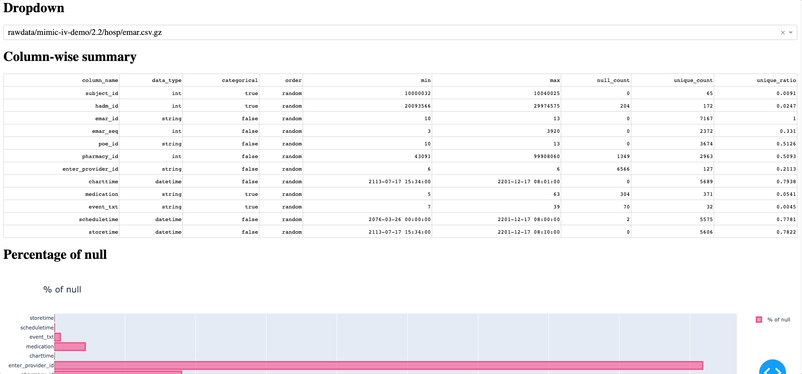

# EHR Data Profiling Tool

A visual data profiler tool allows you to understand structure and content of your data using **visualization** and **statistical summaries**.




## Motivation

Current data profiling tool are mainly text-based
- [pandas-profiling](https://pypi.org/project/pandas-profiling/)
- [DataProfiler](https://pypi.org/project/DataProfiler/)

Text-based data profile is comprehensive but not intuitive, hence it motivates me the creation of the tool.

This project is built with `Python3.10` and `Plotty dash` framework.


## Features

- **Data profiling:** Provides detailed statistics and summaries of EHR data, including missing values, uniquiness and outliers.
- **Data visualization:** Generates interactive graphs and visualizations to help users better understand their EHR data.
- **Data field distribution analysis:** Provides visualizations and statistics to help users understand the distribution of values in each field.

### Supported format
- `csv`
- `csv.gz`
- `dataframe` (to do)
- `parquet` (to do)
- `avro` (to do)


## Getting Started

For the demo, the dataset selected is the Mimic datasets. You will need to have access to a dataset of electronic health records (EHRs) available on [PhysioNet](https://physionet.org/content/mimiciii-demo/1.4/). 

Your need to put your data into your project folder `your-project/rawdata`. The code will recursive scan the `./rawdata` directory.


Clone the repo
```
git clone https://github.com/a4lamber/EHRsdata-profiling.git
```

Create a python virtual environment with `venv`
```bash
python3 -v venv EHRsdata-profiling/env

source EHRsdata-profiling/env/bin/activate
```

install the project dependencies with `pip`
```
pip install -r requirements.txt
```

run the project
```
python3 app.py
```

open your fav browser and run
```
localhost:8050
```


## Contributing

If you find any bugs or have suggestions for new features, please create a new issue in this repository. Pull requests are also welcome.

## License

This project is licensed under the MIT License - see the `LICENSE` file for details.