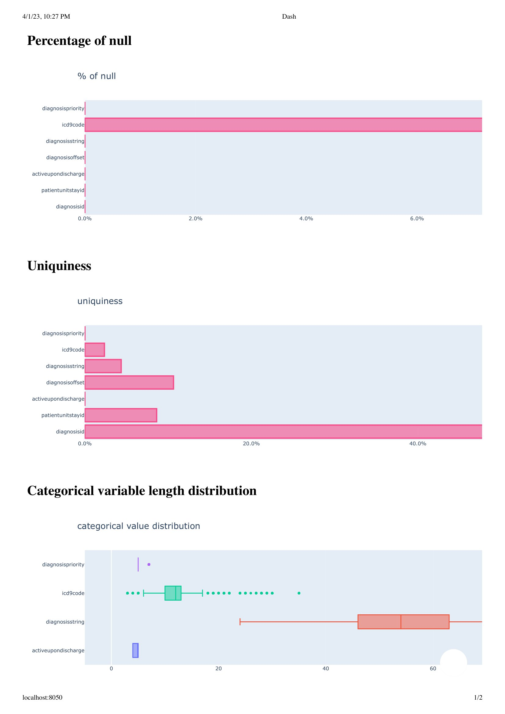
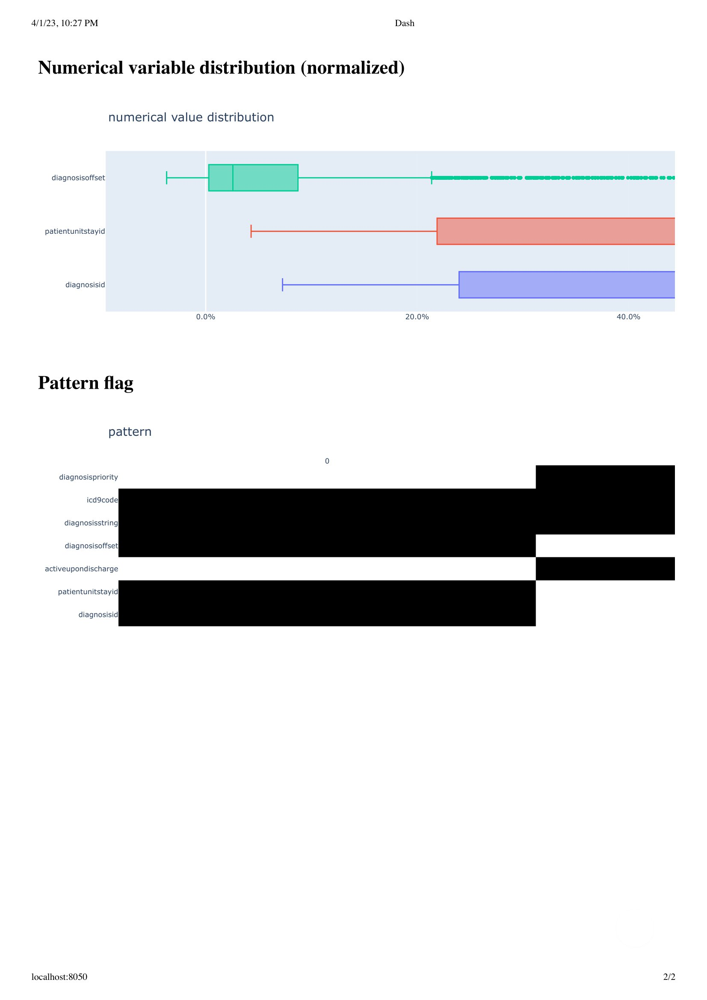

# EHR Data Profiling Tool

This repo is a tool for performing data profiling, visually. Since i believe visual inspection is always more appealing than representing textually. The current feagure is available

## Features

- **Data profiling:** Provides detailed statistics and summaries of EHR data, including missing values, duplicates, and outliers.
- **Data visualization:** Generates interactive graphs and visualizations to help users better understand their EHR data.
- **Data quality assessment:** Evaluates data quality based on a set of pre-defined rules and flags any issues that require attention.
- **Data completeness assessment:** Calculates data completeness percentages for each field in the EHR dataset and identifies fields with low completion rates.
- **Data field distribution analysis:** Provides visualizations and statistics to help users understand the distribution of values in each field.

This project is built with `Python3` and `Plotty dash` framework.

## Getting Started

To get started with this tool, you will need to have access to a dataset of electronic health records (EHRs) available on [PhysioNet](https://physionet.org/content/mimiciii-demo/1.4/). 

For this project, you need `python3` o  

## Contributing

If you find any bugs or have suggestions for new features, please create a new issue in this repository. Pull requests are also welcome.

## License

This project is licensed under the MIT License - see the `LICENSE` file for details.