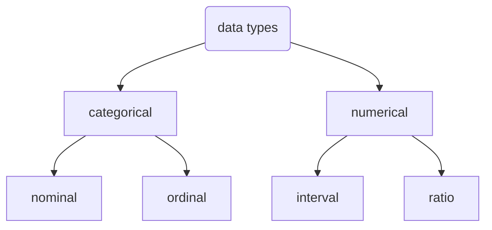
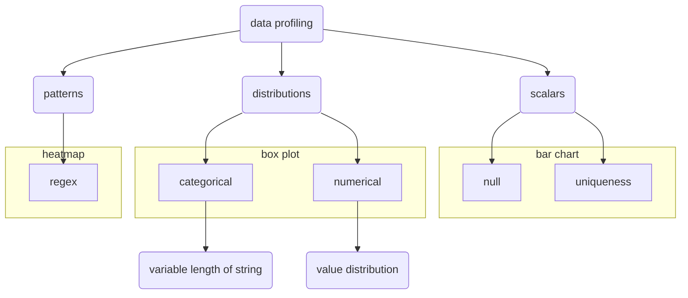

# Data profiler notes


Table of contents:
- [Data profiler notes](#data-profiler-notes)
- [Overview](#overview)
  - [Pre-req](#pre-req)
  - [Methodology](#methodology)
    - [scalars](#scalars)
    - [Distribution](#distribution)
    - [Patterns](#patterns)
- [Report](#report)
- [data quality assessment](#data-quality-assessment)


# Overview

Data profiling is a way to have a first taste of what the data might look like. It is useful since it will inform us what the raw data is like so we could design our filtering and processing functions for those raw data better. Traditionally, data profiling is typically done with textutally. As the number of files increases, the textual solution becomes less clear. On the other hand, visual solution appears to be one of the solution to represent and profile the data better. Therefore, this project is to design a data profiling tool to better understand what the data might look like.

## Pre-req

There are two ways to categorize data, and these are
- statistically categorization
- data structure

You could subcategorize the data based on their characteristics statistically

At the end of the day, you need to store them somehow on your computer. It is implying the data strcture and some of common data structure encoutered in the world of data are:
- primitive data structure: int, float, bool, string
- others: datetime


## Methodology

The method we will take is following the methodology shown in the figure below




### scalars

For scalars, we are mainly going to focus on
- a measure of missing values (% of missing values)
- a measure of unique values used for grouping purpose

The definition of percentage of missing values is straight forward

$$
\begin{align}
\%\,of\,missing\,values= \frac{num_{null}}{num_{rows}}\\
\end{align}
$$
where $num_{row}$ is the total number of row in this column, $num_{null}$ the number of missing values for that particular column


As for a measure of uniqueness, it has multiple ways of defining it such as 
$$
\begin{align}
Uniqueness = \frac{num_{dis}}{num_{row}}
\end{align}
$$
where $num_{row}$ is the total number of row in this column, $num_{dis}$ the number of distinct values for that particular column


The formulation above have some problems
- not able to distinguish the effect of missing values
- the value doesn't scale well, as the data size increases, uniqueness decreases. (1 distinct number, 1000 rows, then Uniquiness = 1e-3, but when 1e6 rows, Uniquiness = 1e-6)

alternative, you could use the form below
$$
\begin{align}
Uniqueness = \frac{num_{dis}-1}{num_{non-missing}-1}
\end{align}
$$
where $num_{non-missing}$ is the number of non-missing values in that column


### Distribution

It is valuable to see the distribution of the dataset for 
- categorical
- numerical


### Patterns

Identification of pattern is an integral part of the data profiling. Some most common ones are:
- Minimal Description Length for Potter wheel tool
- the ReLIE search algorithm
- An alphanumeric pattern profiling

For the alphanumeric pattern profiling, it's kinda confusing to me since it is like
```bash
a0.-/+!*]\`~
```

I don's understand any of these flags but i will list it exhausively

|symbol|description|
|-|-|
|a|there exists alphanumerical (case insensitive)|
|0|exists a numerical values from 0-9|
|-|-|
|-|-|


For the purpose of this, i am just going to examine whether a string contains digits (0-9) or contains alphavet(a-zA-Z) 


# Report

Besides graphical visualization of the profile, it is also recommended to have a `textual profiler` as well. It would be more straight forward to look at 


# data quality assessment

read this for a list of [data quality assessment tool](https://betterprogramming.pub/5-data-quality-tools-you-should-know-about-dacc38aa6ba8)

Need to think about it.