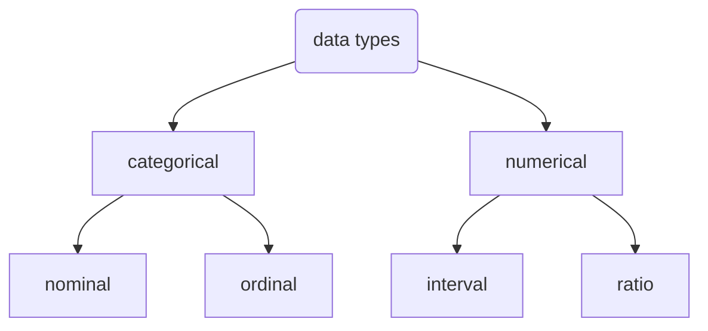
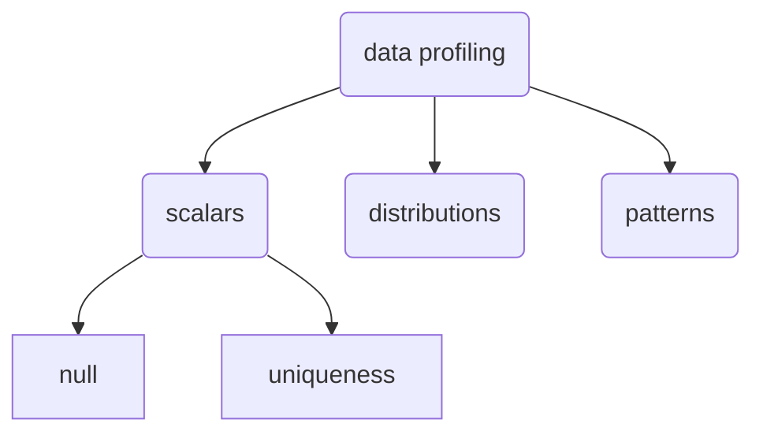

# Data visualization Visualization 

Table of contents:
- [Data visualization Visualization](#data-visualization-visualization)
- [Overview](#overview)
  - [Methodology](#methodology)
    - [scalars](#scalars)
    - [distribution](#distribution)

# Overview

Data profiling is a way to have a first taste of what the data might look like. It is useful since it will inform us what the raw data is like so we could design our filtering and processing functions for those raw data better.

Therefore, this project is to design a data profiling tool to better understand what the data might look like.

You could subcategorize the data based on their characteristics statistically

You could describe those data with primitive data structure:
- for numerical: int, float long etc
- for categorical: string

## Methodology

The method we will take is following the methodology shown in the figure below

### scalars

For scalars, we are mainly going to focus on
- a measure of missing values (% of missing values)
- a measure of unique values used for grouping purpose

The definition of percentage of missing values is straight forward

$$
\begin{align}
\%\,of\,missing\,values= \frac{num_{null}}{num_{rows}}\\
\end{align}
$$
where $num_{row}$ is the total number of row in this column, $num_{null}$ the number of missing values for that particular column

As for a measure of uniqueness, it has multiple ways of defining it such as 
$$
\begin{align}
Uniqueness = \frac{num_{dis}}{num_{row}}
\end{align}
$$
where $num_{row}$ is the total number of row in this column, $num_{dis}$ the number of distinct values for that particular column

The formulation above have some problems
- not able to distinguish the effect of missing values
- the value doesn't scale well, as the data size increases, uniqueness decreases. (1 distinct number, 1000 rows, then Uniquiness = 1e-3, but when 1e6 rows, Uniquiness = 1e-6)

alternative, you could use the form below
$$
\begin{align}
Uniqueness = \frac{num_{dis}-1}{num_{non-missing}-1}
\end{align}
$$
where $num_{non-missing}$ is the number of non-missing values in that column

### distribution

It is valuable to see the type of 